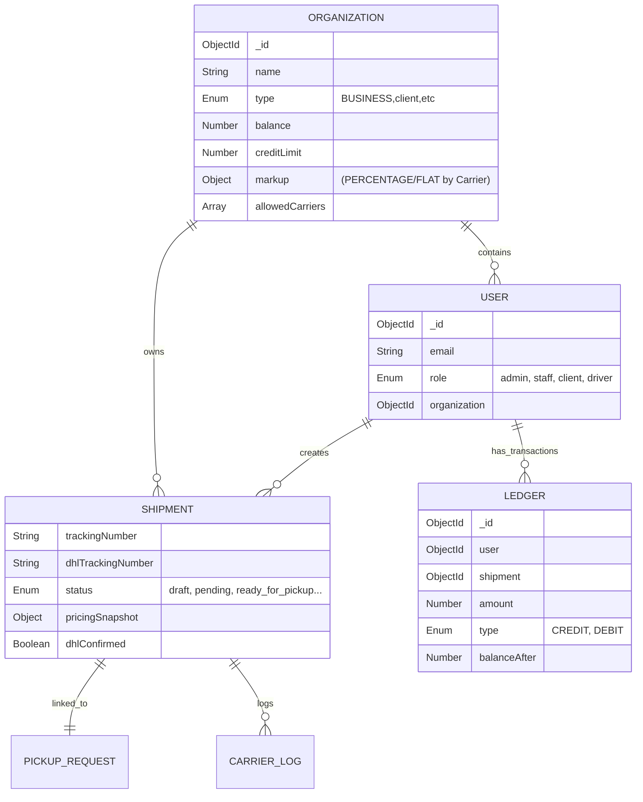
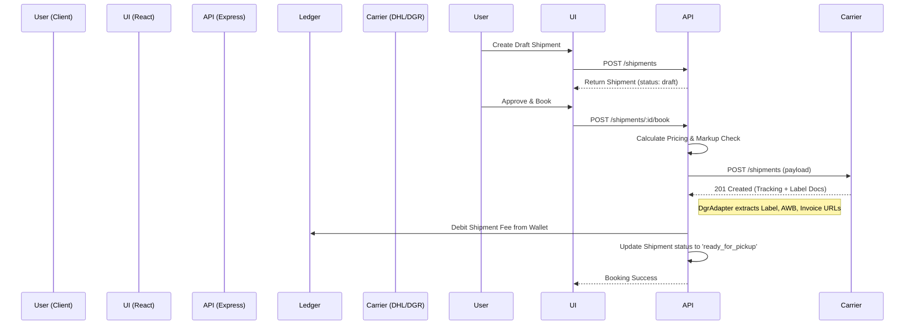
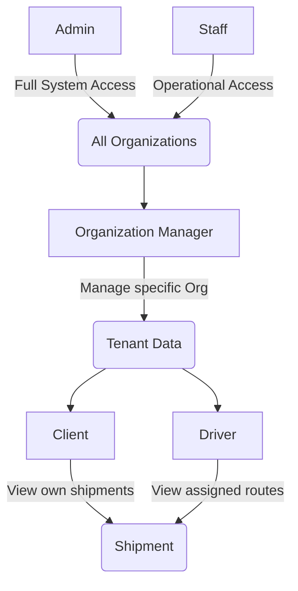
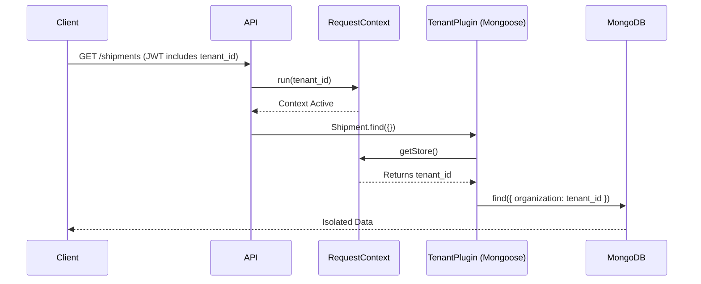
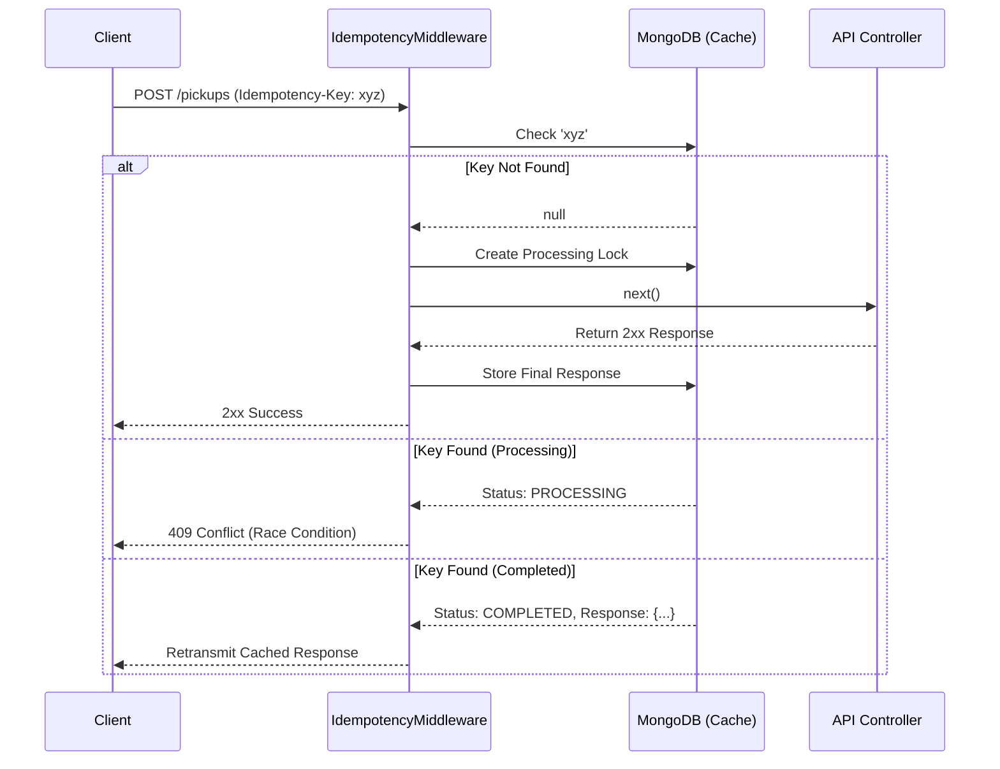
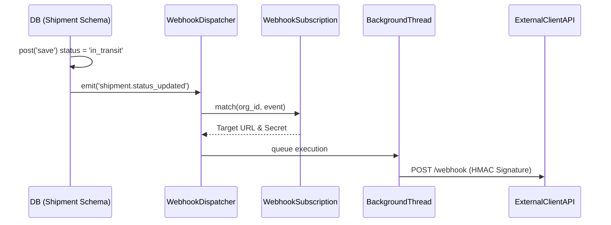

# 🏛️ Architecture Constitution

## Executive Summary
This document serves as the mandatory, version-controlled reference for the 3PL Logistics SaaS platform. The system is designed to manage shipments, multiple carrier integrations (currently led by DHL Express / DGR), a centralized financial ledger with markup logic, and rigorous RBAC enforcing role-specific views and actions. 

**This Constitution defines the protected production boundaries and prevents accidental damage to working flows.** All future edits to the system MUST reference this document, confirm they do not violate protected flows, and update this document if the architecture changes.

---

## 🚫 LOCKED PRODUCTION FLOWS (DO NOT ALTER BEHAVIOR)
The following flows are stable and **MUST NOT** be refactored, restructured, or behaviorally modified without explicit, well-tested architectural approval:
*   **Shipment Creation & Editing:** The lifecycle from `draft` -> `created` -> `ready_for_pickup`.
*   **Pickup & Warehouse Flows:** Driver pickup assignments and warehouse scanning operations.
*   **Approval & Booking with Carrier API:** The `dgr-payload-builder.js` and `DgrAdapter.js` integration that pushes shipments to DHL.
*   **Shipment History & Public Tracking:** Event tracking and event mapping arrays.
*   **User Management & RBAC Enforcement:** The role-based permissions model encompassing clients, staff, admins, drivers, and org managers.
*   **Financial Ledger Logic:** The centralized `Organization` markup calculations and `Ledger` debits/credits.
*   **Carrier API Payload & Response:** Field mappings for the active DHL Express (DGR) account.

*Note: Future carriers (FedEx, Aramex) and additional DHL accounts must be **additive** and isolated using the extension strategy.*

---

## 1. Repo Map & Tech Stack

### Repository Inventory
- `/backend`: Core Node.js API server
- `/frontend`: React SPA dashboard and tracking portals
- `/scripts`: Database seeding and initial user generation
- `/docs`: Additional technical details (Credentials, Maps)
- `docker-compose.yml`: Local & production container orchestration

### Detected Frameworks
*   **Backend:** Node.js, Express.js, Mongoose (MongoDB ODM)
*   **Frontend:** React 18, Material-UI (MUI), Emotion, React Router DOM, SWR
*   **Database:** MongoDB
*   **Integrations:** Axios, jsPDF, Mapbox & Google Maps APIs

### Core Modules
*   **Shipment Engine:** CRUD, Booking, Ops, Tracking
*   **Finance Engine:** Ledger, Pricing Services, Organization Markups
*   **Carrier Adapters:** `CarrierAdapter.js` base class, `DgrAdapter.js` implementation
*   **Auth & Identity:** JWT authentication, bcrypt passwords, RBAC middleware

---

## 2. Backend Architecture
The backend uses an Express.js controller-service-model pattern, grouped by domain boundaries.
*   **Controllers:** Splitting massive domains into focused routers (`shipment-crud`, `shipment-booking`, `shipment-ops`).
*   **Services:** Heavy business logic resides here (`ShipmentBookingService.js`, `financeLedger.service.js`, `pricing.service.js`).
*   **Adapters:** The `/adapters` directory houses integrations for external carrier APIs (DHL).
*   **Payload Builders:** Deterministic transformers constructing API bodies (`dgr-payload-builder.js`).

---

## 3. Database & Data Model



---

## 4. Shipment Lifecycle

**Status Enum Definition** (`backend/src/models/shipment.model.js`):
`['draft', 'pending', 'updated', 'created', 'ready_for_pickup', 'picked_up', 'in_transit', 'out_for_delivery', 'delivered', 'exception']`

*   **Default Status**: `ready_for_pickup` (unless overridden by draft creation).
*   **Key Transition**: Upon successful DHL booking, `backend/src/services/ShipmentBookingService.js` explicitly forces `status = 'created'`.



---

## 5. DHL (DGR) Integration

**The DHL Express integration is locked. Do not modify the existing DGR logic. Add new adapters for new flows.**

### Auth & BYOC (Bring Your Own Carrier)
Basic Auth is constructed via base64 encoded API Key and Secret. To support BYOC, `DgrAdapter.js` actively resolves tenant-specific signatures from the `OrganizationCredential` schema using the global `RequestContext`. If no override exists, it defaults safely to the system `.env` keys.

### Request/Response Persistence
*   **Raw Storage**: Every request and response to DHL is logged via `CarrierLog.create` inside `backend/src/adapters/DgrAdapter.js`. This is stored in the `CarrierLog` collection for auditing. Base64 PDF strings are aggressively truncated before insertion to protect MongoDB memory.
*   **Shipment Record**: Only specific data points (Tracking #, Doc URLs, Base Pricing) are mapped to the actual `Shipment` Mongo document.

### Payload Mapping Summary (DGR -> DHL)
| Origin Field (`models`) | Transform / Builder logic | DHL Request Field |
| :--- | :--- | :--- |
| `shipment.sender.streetLines` | `splitAddress()` into 3 lines (max 45 chars) | `shipperDetails.addressLine1/2/3` |
| `shipment.dangerousGoods` | Built as `valueAddedServices` using UN codes | `valueAddedServices[].serviceCode` |
| `shipment.shipmentDate` | Forced to 10:00 AM next day to avoid errors | `plannedShippingDateAndTime` |
| `shipment.declaredValue` | Mapped to USD/KWD limits | `monetaryAmount[typeCode='declaredValue']`|

### Response Mapping Summary (DHL -> DB)
| DHL Response Field | Stored DB Location | Displayed As |
| :--- | :--- | :--- |
| `shipmentTrackingNumber` | `dhlTrackingNumber` | Used to trace DHL status |
| `documents[typeCode=label]` | Base64 PDF injected to `labelUrl` | Print Label button |
| `detailedPriceBreakdown` | `pricingSnapshot.optionalServices` | Add-on/VAS Cost |
| `totalPrice` / `price` | `costPrice` (Base API), `totalPrice` (with markup) | Client Invoice amounts |

---

## 6. Financial Ledger & Pricing Model

*   **Data Model:** `Ledger` collection stores atomic transactions tied to a `User` and optionally a `Shipment`.
*   **Entry Logic:** Double-entry-like concept. `balanceAfter` acts as the running tally. Negative balances are prevented via `financeHold` checks on the `Organization` prior to booking.
*   **Relationship to Shipments (Debit Condition):** Inside `ShipmentBookingService.js`, *only after* DHL returns a `201 Created` and documents are parsed, a `DEBIT` entry of category `SHIPMENT_CHARGE` is executed via `financeLedgerService.createLedgerEntry`.
*   **Source of Truth:** The `Ledger` collection history is the ultimate source of truth. The `Organization.balance` is a cached summary.

### Markup Application & Persistence
The `PricingService.js` (`resolveMarkup()`) resolves the markup hierarchy in this order:
1. Agent Carrier Override -> 2. Agent Default -> 3. Org Carrier -> 4. Org Default -> 5. System Fallback (15%).
The resulting snapshot is generated via `calculateFinalPrice()` (supporting PERCENTAGE, FLAT, COMBINED, or FORMULA) and saved to `shipment.pricingSnapshot`. A SHA-256 `rateHash` is generated from the wholesale rate and markup to prevent tampering.

---

## 7. RBAC Enforcement Model
The system enforces Role-Based Access Control rigorously via JWT middleware and the `authorizeRoles` route middleware.



- **Admin**: Full system access, can manage organizations, system users, and override rates.
- **Staff**: Internal operations team, can manage daily shipments.
- **Manager / Org Manager**: Tenant admins with visibility over their organization's shipments and ledger.
- **Client**: Standard end-user, restricted strictly to their own organization's sub-data.
- **Driver**: Restricted to assigned pickup routes in the `/driver/pickup` mobile-friendly view.

*Enforcement Constraints*: Organization scoping **IS** now strictly handled at the database driver level. The `RequestContext.js` (powered by `AsyncLocalStorage`) captures the active tenant from the request. The global Mongoose `tenant.plugin.js` intercepts all `find` and `aggregate` pipelines to mathematically enforce isolation. Therefore, cross-tenant data leaks are prevented natively, removing the burden from the controller layer.

---

## 8. Frontend Architecture & Data Flow
- **State Management:** SWR for declarative, cached data fetching. React Context (`AuthContext`, `ShipmentContext`) for global state.
- **Routing:** Complex hierarchical routing using `react-router-dom` v6 inside `routes/index.js`. Protected routes use the `<ProtectedRoute allowedRoles={[]}>` wrapper.
- **Components:** Broken down into atomic `ui/` components (Design System tokens) and composed `components/` (Forms, Modals).
- **Data Flow:** The `ShipmentWizardV2` acts as a multi-step form utilizing local state, dispatching an API call upon validation, and redirecting upon success.

---

## 9. Deployment & Environment Overview
- **Orchestration:** Dockerized via `docker-compose.yml`. Includes Node API, React client build, and MongoDB.
- **Server Environment:** Cloud VPS using aaPanel.
- **Monitoring:** Sentry integration is partially established for production readiness.
- **Proxy:** Nginx / local proxy forwards frontend API requests to `http://localhost:8899`.

---

## 10. Extension Strategy (Carrier Adapter Pattern)
To safely add new carriers without breaking the *Lock*:
1. Create a new subclass of `CarrierAdapter` in `src/adapters/` (e.g., `FedexAdapter.js`).
2. Implement `validate()`, `getRates()`, `createShipment()`, and `getTracking()`.
3. Add the new Carrier identifier to `Organization.allowedCarriers` enum and `User.agentPolicy`.
4. Register the new adapter in the initialization factory (`CarrierFactory.js`).
**Never attempt to retrofit the `DgrAdapter` to accommodate a new carrier's quirks. Isolation is mandatory.**

---

## 11. Risk Areas & Fragility Notes
*   **Ledger Race Conditions:** Concurrent bookings by the same organization could theoretically trigger race conditions on `Organization.balance` updates. Rely solely on atomic Mongo `$inc` operators.
*   **DHL API Strictness:** The DHL API throws generic HTTP 400 errors if string lengths, dangerous goods combos, or postal codes fail exact regex validations. Do not alter `dgr-payload-builder.js` truncation behavior.
*   **Pricing Snapshots:** The `costPrice` and `price` calculation involves floating-point math. Always use `decimal.js` or fixed precision to `.toFixed(3)` for KWD arithmetic to prevent rounding anomalies.

---

## 12. Resolved Architecture Questions (Phase 1)
- **Multi-tenancy Isolation**: Fully isolated at the database level. `tenant.plugin.js` and `AsyncLocalStorage` globally scope all Mongoose queries seamlessly based on the request context.
- **B2B Webhooks**: Implemented fully. The `WebhookDispatcher` service operates asynchronously, triggered natively by Mongoose `post('save')` lifecycle hooks on `shipment.model.js`.
- **Document Storage**: Base64 strings are aggressively stripped from MongoDB (preventing `CarrierLog` bloat). They are buffered to physical files stored locally (`/uploads/documents/`) with relative URLs mapped back to the schemas.
- **API Idempotency**: `POST` mutations are guarded by an `idempotency.middleware.js` interceptor backed by a TTL-indexed `IdempotencyKey` cache, successfully terminating race conditions without altering core controllers.
- **Ledger Precision**: Financial math is strictly calculated using `decimal.js` ensuring 3-decimal KWD integrity across the system.
- **Global Audit Trail**: Entity mutations are observed globally. `audit.plugin.js` hooks into Mongoose `pre('save')` and `post('save')` methods to snapshot delta changes transparently into `SystemAuditLog.model.js`.

---

## 13. Architecture Diagrams (Phase 1 Enhancements)

### Multi-Tenant Data Isolation Flow


### API Idempotency Interceptor


### B2B Webhook Dispatch


### Global Audit Trail
```mermaid
flowchart TD
    A[Mongoose Model] -->|pre('save')| B(audit.plugin.js)
    B -->|Snapshot Data| C{Is Modified?}
    C -->|Yes| D[Store Delta in locals]
    C -->|No| E[Bypass]
    A -->|post('save')| F(audit.plugin.js)
    F -->|Read Locals| G[SystemAuditLog.create]
    G --> H[(Audit DB)]
```

---

## Appendix: Code Evidence Fixtures

### 1. Status Enum Definition (`backend/src/models/shipment.model.js`)
```javascript
  status: {
    type: String,
    enum: ['draft', 'pending', 'updated', 'created', 'ready_for_pickup', 'picked_up', 'in_transit', 'out_for_delivery', 'delivered', 'exception'],
    default: 'ready_for_pickup',
    required: true
  },
```

### 2. Key Transition & Ledger Debit Trigger (`backend/src/services/ShipmentBookingService.js`)
```javascript
            // Transition: force shipment to 'created'
            freshShipment.dhlConfirmed = true;
            freshShipment.status = 'created';
            
            // ... (Document Base64 Extraction)
            
            // Ledger Debit Condition (amount calculated from snapshot and directly billed to ledger)
            const finalPrice = freshShipment.pricingSnapshot?.totalPrice ?? freshShipment.price ?? 0;
            if (finalPrice > 0 && organizationId) {
                await financeLedgerService.createLedgerEntry(organizationId, {
                    sourceRepo: 'Shipment',
                    sourceId: freshShipment._id,
                    amount: finalPrice,
                    entryType: 'DEBIT',
                    category: 'SHIPMENT_CHARGE',
                    description: `Shipment charge: ${freshShipment.trackingNumber}`,
                    reference: freshShipment.trackingNumber,
                    createdBy: payingUser?._id,
                    metadata: { attemptId }
                });
            }
```

### 3. Organization Scoping in Queries (`backend/src/controllers/shipment-crud.controller.js`)
```javascript
        // Manual query injection based on user role
        if (req.user.role !== 'admin' && req.user.role !== 'staff') {
            // Multi-tenant isolation constraint
            query.organization = req.user.organization; 
        }

        const shipments = await Shipment.find(query)
            .sort({ createdAt: -1 })
            .limit(limit * 1)
            .skip((page - 1) * limit)
            .populate('user', 'name email');
```

### 4. DHL Response Persistence mechanism (`backend/src/adapters/DgrAdapter.js`)
```javascript
            // CarrierLog collection isolates full DHL request/response objects
            const res = await axios.post(`${this.config.baseUrl}/shipments`, payload, { headers: this.getAuthHeader() });

            // ...

            // Log Success with raw data
            await CarrierLog.create({
                user: shipmentData.user, 
                shipment: shipmentData._id,
                carrier: 'DGR',
                endpoint: 'createShipment',
                requestPayload: payload,
                responsePayload: res.data,  // <--- Complete raw response storage
                statusCode: res.status,
                success: true,
                durationMs: Date.now() - startTime
            }).catch(e => console.error('Failed to save CarrierLog (Success):', e));
```

### 5. Markup Resolution Priority (`backend/src/services/pricing.service.js`)
```javascript
    /**
     * Resolve effective markup based on precedence rules
     * Precedence: Agent Carrier > Agent Default > Org Carrier > Org Default > System Default
     */
    static resolveMarkup(user, organization, carrierCode) {
        // 1. Agent Carrier Override
        if (user?.agentPolicy?.markupByCarrier?.[carrierCode]) {
            const markup = user.agentPolicy.markupByCarrier[carrierCode];
            if (markup.type && (markup.percentageValue || markup.flatValue)) {
                return { markup, source: 'agent_carrier' };
            }
        }
        
        // ... (continues through priority list 2 to 5)
```
