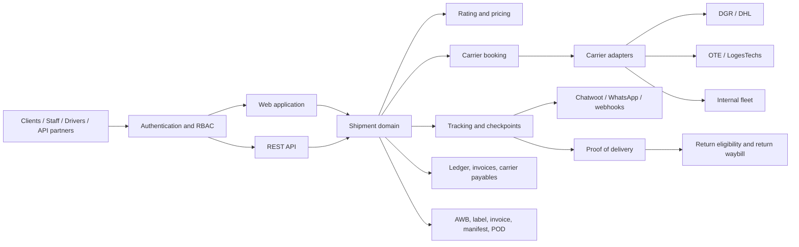
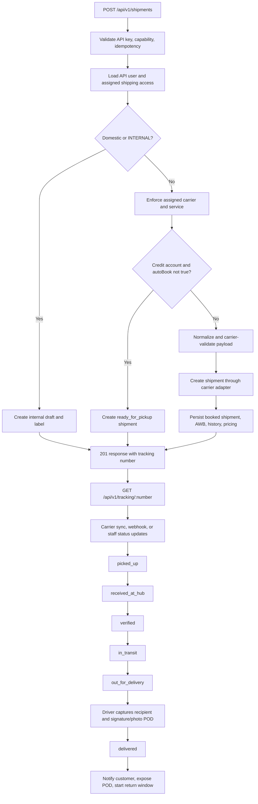
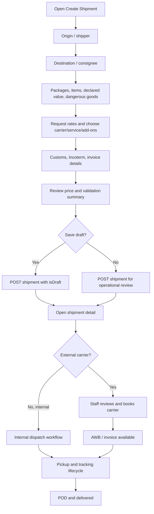
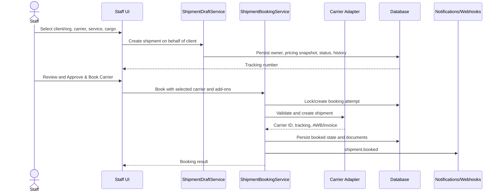
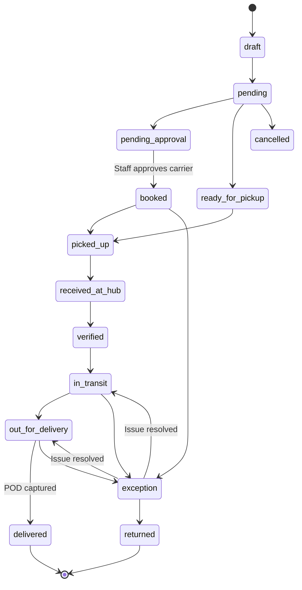
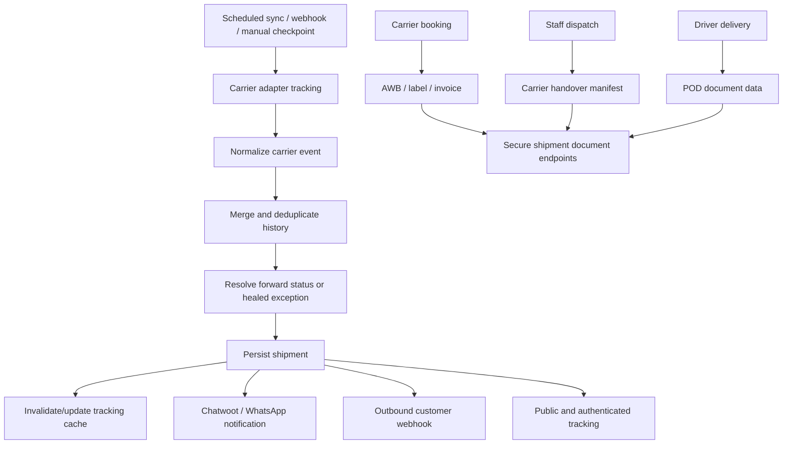
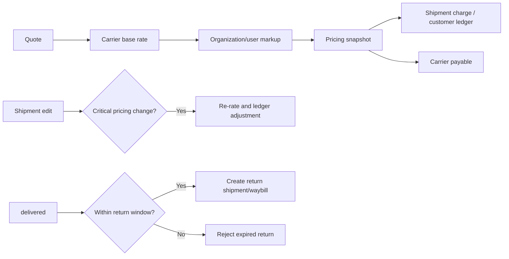

# Target Logistics Platform Function Flows

This document is the operational map for shipment creation, carrier booking, tracking, delivery, and the supporting platform functions. Mermaid diagrams render in GitHub and other Mermaid-compatible documentation viewers.

## 1. Platform overview

## 2. Client API creation and delivery lifecycle

**API contract notes**

- An API client cannot override its assigned carrier/service policy.
- Carrier-booked shipments persist the carrier tracking identifier and initial `booked` event.
- Credit-account shipments can enter the pickup/approval path instead of immediate external booking.
- API tracking returns the canonical status, carrier, service, history, COD fields, and ETA.

## 3. UI shipment wizard

The UI sends both normalized `origin`/`destination` and package/item data, preserves the selected `carrierCode` and `serviceCode`, and navigates to the created shipment using the tracking number returned by the API.

## 4. Staff creation and carrier booking

Staff may select the carrier because platform roles are not constrained like client accounts; booking still applies organization/user policy, pricing snapshots, supported carrier capabilities, and idempotent booking attempts.

## 5. Operational status and delivery flow

All persisted platform statuses use lowercase canonical values. Carrier-specific values are normalized before they update the shipment. A POD delivery adds a `delivered` history event and stores recipient, driver, time, signature/photo, location, notes, and COD collection data.

## 6. Tracking, notifications, and documents

## 7. Finance and returns

## 8. Verification checklist

| Path | Expected result |
| --- | --- |
| Client API creation | `201`, assigned carrier/service enforced, tracking number returned |
| UI creation | Shipment persists wizard addresses, cargo, carrier/service, pricing, and history |
| Staff on-behalf creation | Owner/organization visibility is correct and selected carrier is retained |
| Staff carrier booking | Carrier adapter receives the selected carrier and add-ons; AWB/tracking persist |
| Status lifecycle | Each operational status appends history and uses canonical lowercase values |
| Delivery | POD is stored and final shipment/history status is `delivered` |
| Tracking | API/UI/public views show current status and deduplicated history |
| Notifications | Creation, booking, movement, exception, and delivery events dispatch as configured |
| Finance | Charge, markup, adjustments, COD, and carrier payable remain traceable |
| Returns | Only delivered shipments inside the configured window can create a return |
